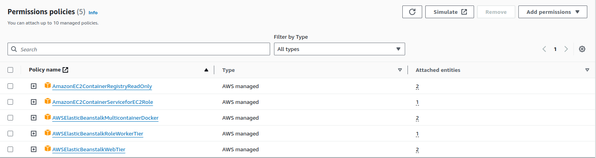
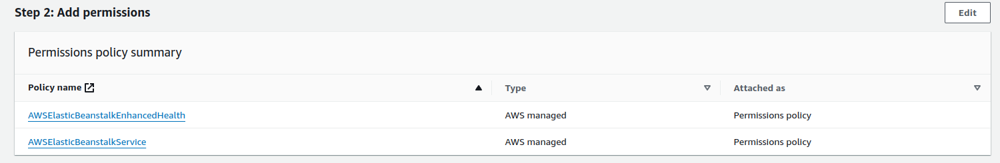

# Terraform module for Elastic Beanstalk
This module creates an Elastic Beanstalk application and environment.
## Available features
- Beanstalk application
- Certificate management
## Set up
- Set up instance profile for ec2, with these permissions (if IAM permission lacking)

- Set up service role

- Import the module
```terraform
module "beanstalk" {
  source = "../../modules/beanstalk"
  app_name = "test-app"
  ec2_instance_profile = var.ec2_instance_profile
  instance_port = 80
  service_role = var.service_role
  rds_enabled = false
}
```

## How to use it
### With RDS:
```terraform
module "beanstalk" {
  source = "../../modules/beanstalk"
  app_name = "test-app"
  ec2_instance_profile = var.ec2_instance_profile
  instance_port = 80
  service_role = var.service_role
  rds_enabled = true
  db_username = "postgres"
  db_password = "somethinghere"
}
```
### With domain name (prerequisites: Route53 hosted zone created and domain name registered):
```terraform
module "beanstalk" {
  source = "../../modules/beanstalk"
  app_name = "test-app"
  ec2_instance_profile = var.ec2_instance_profile
  instance_port = 80
  service_role = var.service_role
  rds_enabled = false
  dns_zone = "yourweb.com"
}
```

## Customization
| Variable                | Type          | Required | Default Value                                                        |
|-------------------------|---------------|-------|----------------------------------------------------------------------|
| app_name                | string        | yes   |                                                                      |
| instance_port           | number        | yes   |                                                                      |
| key_directory           | string        |       | ~/.ssh/id_rsa.pub                                                    |
| min_size                | number        |       | 1                                                                    |
| max_size                | number        |       | 2                                                                    |
| is_ecs                  | bool          |       | true                                                                 |
| app_instance_subnets    | map(string)   |       | {"ap-southeast-1a": "10.0.1.0/24", "ap-southeast-1b": "10.0.2.0/24"} |
| app_elb_subnets         | map(string)   |       | {"ap-southeast-1a": "10.0.3.0/24", "ap-southeast-1b": "10.0.4.0/24"} |
| service_role            | string        | yes   |                                             |
| ec2_instance_profile    | string        | yes   |                                                    |
| rds_enabled             | bool          |       | true                                                                 |
| db_engine               | string        |       | postgres                                                             |
| db_instance_class       | string        |       | db.t3.micro                                                          |
| db_engine_version       | string        |       | 14.5                                                                 |
| db_allocated_storage    | string        |       | 10                                                                   |
| db_username             | string        |       | postgres                                                             |
| db_password             | string        |       | pass                                                                 |
| db_is_multi_az          | bool          |       | false                                                                |
| dns_zone                | string        | if use dns name | none                                                                 |

